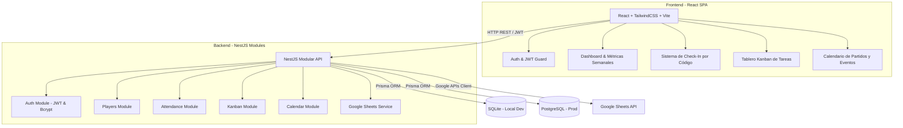

# ESPECIFICACIONES DE ARQUITECTURA Y MIGRACIÓN: SUAREZ VOLEY CLUB

## 📐 1. Visión General de la Arquitectura Objetivo

El proyecto evoluciona de un monolito liviano en Python (FastAPI + SQL crudo + Pandas/Excel) a una **arquitectura modular fullstack desacoplada**, escalable, mantenible y lista para producción.



---

## 🛠️ 2. Stack Tecnológico

### Backend
* **Framework:** NestJS (TypeScript, Node.js).
* **ORM:** Prisma ORM.
* **Bases de Datos:**
  * **Local / Desarrollo:** SQLite (`dev.db`).
  * **Producción / Staging:** PostgreSQL.
* **Autenticación:** Passport-JWT + `@nestjs/jwt` + `bcrypt`.
* **Integración Externa:** Google Sheets API (`googleapis` v100+) usando Service Account para sincronización continua en tiempo real.

### Frontend
* **Core:** React 18+ (TypeScript) generado con Vite.
* **Estilos & UI:** TailwindCSS + Lucide Icons + Shadcn UI / Radix primitives.
* **Gestión de Estado & Server State:** TanStack Query (React Query) + Zustand.
* **Enrutamiento:** React Router v6.
* **Visualización de Datos:** Recharts (para métricas de asistencia del dashboard).
* **Componentes Especiales:** `@hello-pangea/dnd` (Tablero Kanban), `FullCalendar` / `react-big-calendar`.

### Testing & QA
* **E2E & UI Testing:** Playwright TypeScript (`@playwright/test`).
* **Unit Testing Backend:** Jest (nativo NestJS).
* **Unit Testing Frontend:** Vitest + React Testing Library.

---

## 🏗️ 3. Módulos y Dominio del Sistema

### A. Módulo de Autenticación & Usuarios (`AuthModule`)
- Login de administradores y entrenadores con credenciales (email / contraseña).
- Emisión de JWT Tokens de corta duración (ej. 1h) y Refresh Tokens.
- Control de acceso por Roles (RBAC: `ADMIN`, `COACH`, `STAFF`).
- Endpoint público para Check-in sin requerir login si se configura acceso rápido de kiosco.

### B. Módulo de Jugadores & Asistencia (`PlayersModule` & `AttendanceModule`)
- CRUD completo de Jugadores.
- Generación y asignación de código único de 4 dígitos.
- Check-in instantáneo por código.
- Registro histórico de asistencias con timestamps.
- **Sincronización con Google Sheets:** Event Listener en NestJS que reenvía las altas y asistencias a una hoja de cálculo en la nube vía Google Sheets API.

### C. Módulo de Dashboard y Métricas (`DashboardModule`)
- Muestra de jugadores asistidos en el día y en la semana actual.
- Gráficos comparativos de asistencia por día de entrenamiento y categoría.
- Acceso directo de 1-click al portal de Check-in rápido.

### D. Módulo Kanban (`KanbanModule`)
- Gestión de tareas operativas del club (Ej: "Comprar pelotas", "Organizar torneo", "Cobro de cuotas").
- Columnas personalizables: `Por Hacer`, `En Proceso`, `Revisión`, `Completado`.
- Drag and drop interactivo en Frontend.

### E. Módulo de Calendario y Eventos (`CalendarModule`)
- Programación de partidos, fechas de entrenamiento, torneos y reuniones.
- Alertas y notificaciones en dashboard sobre eventos próximos (próximos 7 días).

---

## 🗄️ 4. Esquema de Datos con Prisma (`schema.prisma`)

```prisma
datasource db {
  provider = env("DATABASE_PROVIDER") // "sqlite" o "postgresql"
  url      = env("DATABASE_URL")
}

generator client {
  provider = "prisma-client-js"
}

enum Role {
  ADMIN
  COACH
  STAFF
}

model User {
  id        String   @id @default(uuid())
  email     String   @unique
  password  String
  name      String
  role      Role     @default(COACH)
  createdAt DateTime @default(now())
  updatedAt DateTime @updatedAt
  tasks     Task[]
}

model Player {
  id          String       @id @default(uuid())
  code        String       @unique // 4 dígitos
  name        String
  age         Int
  timeInClub  Int          // Meses o años en el club
  active      Boolean      @default(true)
  createdAt   DateTime     @default(now())
  updatedAt   DateTime     @updatedAt
  attendances Attendance[]
}

model Attendance {
  id        String   @id @default(uuid())
  playerId  String
  player    Player   @relation(fields: [playerId], references: [id], onDelete: Cascade)
  date      DateTime @default(now())
  createdAt DateTime @default(now())
}

model Task {
  id          String     @id @default(uuid())
  title       String
  description String?
  status      TaskStatus @default(TODO)
  priority    Priority   @default(MEDIUM)
  dueDate     DateTime?
  userId      String?
  user        User?      @relation(fields: [userId], references: [id])
  createdAt   DateTime   @default(now())
  updatedAt   DateTime   @updatedAt
}

enum TaskStatus {
  TODO
  IN_PROGRESS
  REVIEW
  DONE
}

enum Priority {
  LOW
  MEDIUM
  HIGH
  URGENT
}

model Event {
  id          String    @id @default(uuid())
  title       String
  description String?
  startDate   DateTime
  endDate     DateTime
  location    String?
  category    EventType @default(MATCH)
  createdAt   DateTime  @default(now())
}

enum EventType {
  MATCH
  TRAINING
  TOURNAMENT
  MEETING
  OTHER
}
```

---

## 🧪 5. Sistema de QA y Control de Calidad con Playwright

Se establece una regla estricta: **Cero progreso a una nueva fase sin aprobación previa de la suite de QA.**

### Protocolo de Evaluación QA antes de cambio de fase:
1. **Verificación Backend:**
   - Compilación sin errores TypeScript (`tsc --noEmit`).
   - Cobertura de tests unitarios NestJS (`npm run test`).
2. **Verificación Frontend:**
   - Linting y formateo limpio (`eslint`, `prettier`).
   - Build de producción Vite sin advertencias ni fallos.
3. **Pruebas E2E de Playwright:**
   - Flujo de Login y protección de rutas con JWT.
   - Flujo de creación de Jugador y asignación de código de 4 dígitos.
   - Flujo de Check-in y actualización de métricas del Dashboard en tiempo real.
   - Interacción Drag-and-Drop del Tablero Kanban.
   - Creación y visualización de eventos en el Calendario.
