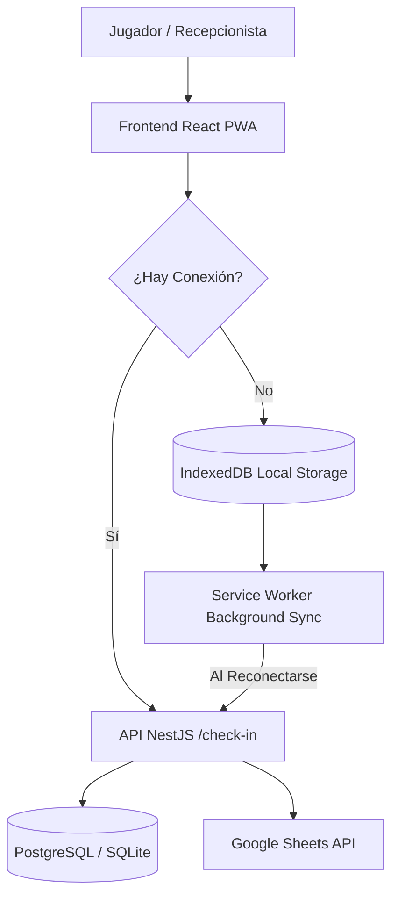

# ESPECIFICACIONES DE LA PWA (PROGRESSIVE WEB APP) - SUAREZ VOLEY CLUB

## 📱 1. Visión y Necesidad de Negocio

En la cancha del club o en torneos externos, la conexión a internet puede ser inestable o inexistente. La **PWA** permite transformar la aplicación web en una aplicación instalable en teléfonos, tablets o la PC de recepción, permitiendo realizar el **Check-in de asistencia de jugadores completamente sin conexión (Offline)** y sincronizar automáticamente al recuperar la señal.

---

## 🏗️ 2. Arquitectura Offline-First de la PWA



---

## 🛠️ 3. Componentes Técnicos de la PWA

### A. Configuración con `vite-plugin-pwa`
Utilización del plugin oficial de Vite para la generación del Service Worker y Manifest de forma automatizada:

```typescript
// vite.config.ts
import { defineConfig } from 'vite';
import react from '@vitejs.plugin-react';
import { VitePWA } from 'vite-plugin-pwa';

export default defineConfig({
  plugins: [
    react(),
    VitePWA({
      registerType: 'autoUpdate',
      includeAssets: ['favicon.ico', 'robots.txt', 'icons/*.png'],
      manifest: {
        name: 'Suarez Voley Club - Sistema de Asistencias',
        short_name: 'SVC Asistencia',
        description: 'Control de asistencia y gestión del Suarez Voley Club',
        theme_color: '#1E3A8A',
        background_color: '#F3F4F6',
        display: 'standalone',
        orientation: 'portrait',
        icons: [
          {
            src: 'icons/pwa-192x192.png',
            sizes: '192x192',
            type: 'image/png'
          },
          {
            src: 'icons/pwa-512x512.png',
            sizes: '512x512',
            type: 'image/png',
            purpose: 'any maskable'
          }
        ]
      },
      workbox: {
        globPatterns: ['**/*.{js,css,html,ico,png,svg}'],
        runtimeCaching: [
          {
            urlPattern: /^https:\/\/.*\/api\/jugadores.*/i,
            handler: 'StaleWhileRevalidate',
            options: {
              cacheName: 'api-players-cache',
              expiration: {
                maxEntries: 200,
                maxAgeSeconds: 60 * 60 * 24 // 24 horas
              }
            }
          }
        ]
      }
    })
  ]
});
```

---

## 💾 4. Estrategia de Almacenamiento Offline & Sincronización

### A. IndexedDB para Asistencias Pendientes (`Dexie.js`)
Cuando la app detecta estado `navigator.onLine === false`:
1. El check-in de 4 dígitos valida contra los jugadores cacheados localmente.
2. Guarda el registro en la cola IndexedDB: `{ id, codigo, timestamp, synced: false }`.
3. Notifica visualmente en la UI: `"Asistencia guardada localmente (Modo Offline)"`.

### B. Sync Batch Endpoint (NestJS)
Grok (Backend) implementará el endpoint de recepción masiva:
- `POST /check-in/batch-sync`
- Recibe un arreglo de registros offline acumulados.
- Procesa transaccionalmente las asistencias e ignora duplicados.

### C. Re-conexión Automática (BigPickle - Frontend)
- Escuchador global de eventos `window.addEventListener('online', syncPendingAttendances)`.
- Disparo de Background Sync API del Service Worker al restaurar internet.

---

## 🧪 5. Pruebas E2E de PWA con Playwright

BigPickle y el sistema de QA validarán el modo Offline en Playwright mediante la simulación de red:

```typescript
test('Debe registrar asistencia offline y sincronizar al reconectar', async ({ page, context }) => {
  // 1. Simular pérdida de red
  await context.setOffline(true);
  
  // 2. Realizar check-in
  await page.fill('[data-testid="input-codigo"]', '1234');
  await page.click('[data-testid="btn-checkin"]');
  await expect(page.locator('.status-offline')).toContainText('Guardado localmente');

  // 3. Restaurar red
  await context.setOffline(false);
  await page.waitForTimeout(1000);
  
  // 4. Validar sincronización
  await expect(page.locator('.status-sync')).toContainText('Sincronizado con éxito');
});
```
